# BWidgets
Widget toolkit of the B.Music project.

The B.Widgets toolkit is a widget toolkit intended for small (single window)
standalone applications and for plugins. It comes along with a series of
built-in widgets, including labels, buttons, dials, sliders, menues and so on.

B.Widgets allows recursive embedding of widgets including changing the order
of embedding. 

B.Widgets supports events from the keyboard, the mouse, the host windowing 
system and also internal events like value change and messaging events.

B.Widgets supports the system locale / messages translations and its own
extensible dictionary for internationalization.

Widgets can be decorated using styles.

## Quickstart

1. Include the header files of the widgets you need.
   ```
   #include "path/to/BWidgets/Window.hpp"
   #include "path/to/BWidgets/TextButton.hpp"
   ```
   Optional, simplify using namespace BWidgets, BStyles, and BEvents:
   ```
   using namespace BWidgets;
   using namespace BStyles;
   using namespace BEvents;
   ```

2. Create a main window object.
   ```
   Window window (200, 100, 0);  // Creates an empty window with size 200 x 100
   ```

3. Create the widget objects you need.
   ```
   Label label ("Button pressed");  // Creates a label with the text
                                    // "Button pressed" and optimized size.

   TextButton button (70, 40, 60, 20, "Press"); // Creates a text Button
                                                // at position 70, 40 with
                                                // the size 60 x 20 and
                                                // the text "Press".
   ```

4. Inside `int main()`, add the widgets to the main window (or to other 
widgets which are (or will be) added to the main window).
   ```
   window.add (&label);     // Adds the label to the window.
   window.add (&button);    // Adds the button to the window.
   ```
   Note: Linking widgets to the main window make them visible by default.

5. Optional, change widget attributes and change decoration.
   ```
   
   label.moveTo (label.center(), label.bottom ()); // Move label to bottom
                                                   // center.
   ```

6. Optional, handle events using callbacks.

   First create a callback function. 
   ```
   void valueChangedCallback (BEvents::Event* event)
   {
       ValueChangeTypedEvent<bool>* e =                        // Cast type of
           dynamic_cast<ValueChangeTypedEvent<bool>*>(event);  // event

       if (e)
       {
           if (e->getValue()) label.show();                    // Show if press
           else label.hide();                                  // Otherwise hide
       } 
   }
   ```

   Then link this callback function.
   ```
   button.setCallbackFunction (Event::VALUE_CHANGED_EVENT, 
                               valueChangedCallback);
   ```

7. For standalone applications, process until the main window will be closed.
   ```
   window.run ();
   ```

Build and run. You can also find this source code at [../examples/buttontest.cpp](../examples/buttontest.cpp).

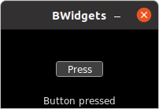

## Namespaces

The toolkit uses tools from six namespaces:
* `BDevices`
* `BEvents`
* `BMusic`
* `BStyles`
* `BUtilities`
* `BWidgets`


### BDevices

Interaction with the system input devices (mouse, keyboard).


### BEvents

The [`BEvents`](../BEvents/README.md) namespace contains different classes of
events. `BEvents` are emitted by a widget (or by the system via the main
window) to the main window event queue.


### BMusic

The [`BMusic`](../BMusic/README.md) namespace contains classes and algorithms for audio processing.


### BStyles

The [`BStyles`](../BStyles/README.md) namespace contain classes to describe a
widget style.


### BUtilities

The `BUtilities` namespace contains a collection of different useful tools.


### BWidgets

Core namespace of the BWidgets toolkit. Contains all widget classes and the 
supporting interface classes.


## Widgets

All widgets are located in the BWidgets namespace. And all widgets are
derived from the `Widget` class. Including the main `Window`. Each class may
additionally inherit from [Support](#Supports) classes to extend its features.

```
Widget
 ├── Window
 ├── Label
 |    ├── LabelEdit
 |    ╰── Text
 ├── Symbol
 ├── Button
 |    ├── TextButton
 |    ├── SymbolButton
 |    ├── ImageButton
 |    ├── Checkbox
 |    ├── RadioButton
 |    ├── Knob
 |    ├── HSwitch
 |    ╰── VSwitch
 ├── SpinButton
 ├── Pad<T>
 |    ╰── SymbolPad<T>
 ├── Pattern<T>
 ├── HPianoRoll
 ├── HMeter
 |    ├── ValueHMeter
 |    ╰── HScale
 |         ├── HScrollBar
 |         ╰── HSlider
 |              ╰── ValueHSlider
 ├── HRangeScrollBar
 ├── VMeter
 |    ├── ValueVMeter
 |    ╰── VScale
 |         ├── VScrollBar
 |         ╰── VSlider
 |              ╰── ValueHSlider
 ├── VRangeScrollBar
 ├── RadialMeter
 |    ├── ValueRadialMeter
 |    ╰── Dial
 |         ╰── ValueDial
 ├── Image
 ├── ConditionalImage
 ├── ImageHMeter
 |    ╰── ImageHSlider
 ├── ImageVMeter
 |    ╰── ImageVSlider
 ├── ImageRadialMeter
 |    ╰── ImageDial
 ├── SpinBox
 |    ├── ListBox
 |    ╰── ComboBox
 ├── Frame
 |    ├── Box
 |    |    ╰── TextBox
 |    |         ╰── MessageBox
 |    ╰── FileChooser
 |         ╰── SampleChooser
 .   
 .    
 .    
```

Each widget class Xxx has got at least four* different constructors
(demonstrated on the example of `ComboBox`):
* `Xxx ()` - The parameter free default constructor. It creates a 
  default default-sized empty (or default content) widget. 
  ```
  ComboBox ();
  ```
* `Xxx (urid, title)` - Creates a default default-sized empty (or default 
  content) widget and defines its urid and title.
  ```
  ComboBox (0, "ComboBox");
  ```
* `Xxx (data, urid, title)` - Creates a default-sized widget with the passed 
  data, urid (optional) and title (optional).
  ```
  ComboBox ({"Berlin", "London", "Madrid", "Paris"});
  ```
* `Xxx (x, y, width, height, data, urid, title)` - Creates a widget at the
  position (x, y) relative to the parent widget with the extends (width, 
  height) with the passed data (optional), urid (optinal) and title 
  (optional)**.
  ```
  ComboBox (0, 0, 120, 20, {"Berlin", "London", "Madrid", "Paris"});
  ```

  \*Widgets without any additional data to pass (Widget, Frame) have only got
  three constructors.

  \*\*Window also has got additional optional parameters after title.

You can re-define the widget default size used for `Xxx ()`, 
`Xxx (urid, title)` and `Xxx (data, urid, title)` by defining the macros 
`BWIDGETS_DEFAULT_XXX_WIDTH` and `BWIDGETS_DEFAULT_XXX_HEIGHT`.

**Note: Widgets in B.Widgets don't have got any copy constructors or 
assignment operators!**

But all widgets have got the following two methods which you can use instead:
* `copy (&other)` - Copies the content (but not the linkage and not the URID) 
  from the other object.
* `clone ()` - Clones this object by creating a new object on the heap (don't
  forget to delete at the end) and copies the content including the URID (but 
  not its linkage) to the new object.


### Main Window

The main `Window` object is the core `Widget` in BWidgets. Each project MUST
contain exactly one `Window` object (more are not allowed, less don't make
any sense).

The main `Window` object controls the visibility of all linked widgets. All
Widgets need be be linked to the main `Window` object to become visible.

A simple example of linking and visualizing a "Hello World" `Label` to a 
`Window` (see [../examples/helloworld.cpp](../examples/helloworld.cpp)):
```
int main ()
{
     Window w;                // Creates an empty window with default size
     Label l ("Hello World")  // Creates a "Hello world" label
     w.add (&l);              // Links the label to the window
     w.run ();                // Keeps the window open until close
}
```

The main `Window` object also controls and routes the events emitted by the
linked widgets and by the host system in its event queue and its event
handler. 

The full event routing process is:
1.  Emission of an event either by a `Widget` either
    * by a host event and an assignment to a `Widget` by the main `Window`
      translate function, or
    * by the `Widget` directly

    to the main `Window` event queue.
2.  Analyzing, merging and routing in the main `Window` event handler and
    calling the widget `onXXX()` method.
3.  Responding in the widget `onXXX()` method and optional call of a linked
    `Callback` function.
4.  Optional, respond to the effect in a `Callback` function.


### Widget

`Widget` is the base widget class of BWidgets.

All widgets support the features:
* Linkable (may got linked to parent and child widgets)
* Visualizable (may draw to RGBA surface layers and may become visible)
* EventMergeable (may let the main `Window` merge its events)
* EventPassable (may pass events to the subjacent widget)

In addtion, widgets have got:
 * an *URID* to identify the widget,
 * a *position* to be placed (relative to its parent widget),
 * an infomation about its *stacking* type,
 * a *status* ,
 * a *title* , and
 * a *style* .

`Widget` objects are the most simple widgets. Their visual content is only
defined by the `Style` properties border and background. And the title may
be shown on hovering over the widget (if title is set). There is no further 
user interaction.

Each `Widget` must be directly or indirectly linked to the main `Window` to
become visible.


### Frame

`Frame` is a simple derivative of `Widget` without any additional content.
But it supports `Draggable`. This means, you can drag and drop `Frame`
objects.


### Label

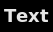

`Label` is a simple one line text output widget. It can be decorated by setting
a font and a text color in addtion to the style properties supported by
`Widget`. 


### LabelEdit

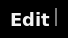

`LabelEdit` is an editable version of `Label`. It additionally supports:
* `Clickable` and `Draggable` to set the cursor,
* `KeyPressable` to enter / change a text via the keyboard, and
* `Valueable` to store the text and inform the event handler.

`LabelEdit` can be decorated like a `Label`.


### Text

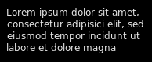

`Text` is a multi line text output widget. It can be decorated like a `Label`.


### Image

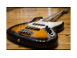

`Image` is an image displaying widget. It supports one image for each Status.


### Symbol

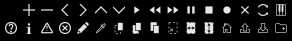

`Symbol` is a Widget that displays a symbol. It can be decorated by setting
a TxColor in addtion to the StyleProperty settings supported by Widget. 


### Button

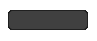

`Button` draws a simple button. It supports `Clickable` and `Valueable`. The
value has two conditions: on (true) or off (false). A `Button` changes its 
border color upon changing the condition.


### TextButton

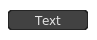

`TextButton` is a `Button` containing a label. A `TextButton` changes its 
label status (and thus its color) in addition to the change of its border
color upon changing the condition.


### SymbolButton

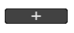

`SymbolButton` is a `Button` containing a `Symbol`. A SymbolButton changes its
symbol status (and thus its color) in addition to the change of its border
color upon changing the condition.


### ImageButton


`ImageButton` is a `Button` containing an `Image`. A ImageButton changes its 
image status (and thus its visual content) in addition to the change of 
its border color upon changing the condition.


### CheckBox

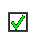

`CheckBox` is a `Button` Widget. Its appearance is defined by the BgColors
parameter (frame) and by the FgColors parameter (active state, symbol).


### RadioButton

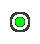

`RadioButton` is a `Button` Widget. Its appearance is defined by the BgColors
parameter (frame) and by the FgColors parameter (active state, fill).


### Knob

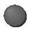

`Knob` is a `Button` Widget. It is a pseudo 3D visualization of a knob which
can change its status (bool value) upon user interaction via `Clickable`. 
Its appearance is defined by the BgColors parameter (static elements, 
false) and by the FgColors parameter (active elements, true).


### HSwitch

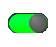

`HSwitch` is a `Button` Widget. It displays its status (represented by its 
bool value) as a horizontal switch. It supports user interaction via 
`Clickable`, `Draggable`, and `Scrollable`. Its appearance is defined by the 
BgColors parameter (static elements, false) and by the FgColors parameter
(active elements, true).


### VSwitch

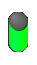

`VSwitch` is a `Button` Widget. It displays its status (represented by its 
bool value) as a vertical switch. It supports user interaction via 
`Clickable`, `Draggable`, and `Scrollable`. Its appearance is defined by the 
BgColors parameter (static elements, false) and by the FgColors parameter
(active elements, true).


### SpinButton

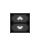

`SpinButton` is a `Valueable` composite widget. It contains an up and a down
`SymbolButton`. Its value can either be 0 (no button pressed) or -1 (up button
pressed) or 1 (down button pressed). The visualble content of the SpinButton 
is represented by its background and its border.


### Pad\<T\>

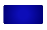

`Pad` is a `Valueable` widget imitating an LED pad. Its value is represented
by its color from dark to bright. It supports user interaction via
`Clickable` (switch on / off) and `Scrollable` (increase / decrease value). 
The visualble content of the Pad is represented by FgColors.


### SymbolPad\<T\>

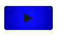

`SymbolPad` is a `Pad` containing a `Symbol`. Its value is represented
by its color from dark to bright. It supports user interaction via
`Clickable` (switch on / off) and `Scrollable` (increase / decrease 
value). The visualble content of the %SymbolPad is represented by 
FgColors.

### Pattern\<T\>

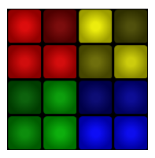

`Pattern` is a `Valueable` widget displaying a pattern of pad widgets 
(default: `Pad`s). It is intended to use a Pad-derived widget to display a
step or pad sequencer-like pattern, but it is also possible to use any 
other Valueable widget. The pad widgets value type
* MUST support the standard comparison operators, 
* MUST support the standard arithmetic operators. 
* MUST be compatible with `ValueableTyped`, `ValidatableRange`, and
  `ValueTransferable`.

Pattern allows to draw a pattern by left-clicking on the pads or dragging
over the pads via support of `Draggable` and setting the pad values to 
their `getMin()` or defined default drawing value (defined with
`pads.setValue()`), respectively.
 
Right-clicking picks the respective pad value and re-defines the default 
drawing value. This action is equivalent to left-clicking in the
`PICK_MODE`.

If the select mode is on (by setting the EditMode, e. g., cut, copy, 
delete, swap), pressing the left mouse button or dragging will mark the 
respective pad instead and the action of the 
selected EditMode will be applied after the button release.

The value of the Pattern is a 2D vector of `std::pair` with the repective 
pad extends (default: `BUtilities::Point<size_t>(0, 0)`) as the first and 
the respective pad value as the second type.


### HPianoRoll

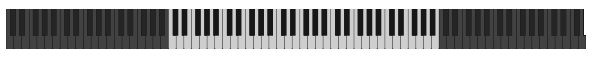

`HPianoRoll` is a `Valueable` Widget displaying a horizontal piano roll.
It supports user interaction via `Clickable`, `Draggable`, and 
`Toggleable`. Its appearance is defined by the BgColors parameter 
(inactive keys) and by the FgColors parameter (active keys).


### HMeter

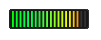

`HMeter` is a `Valueable` Widget and displays a value as a horizontal
meter without user interaction. The value is kept within a defined range
and displayed in blocks defined by the parameter *step* . Its appearance
is defined by the parameters BgColors (static elements), FgColors (value,
low range), and HiColors (value, high range).

Advanced settings allow a `HMeter` to display a value in a non-linear
manner (e.g. for levels and frequencies) using transfer functions and / or
to use non-line color gradients for display using gradient functions.


### ValueHMeter

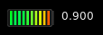

`ValueHMeter` is a `HMeter` Widget with an additional label for
displaying its value.


### HScale

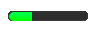

`HScale` is a `Valueable` Widget derived from `HMeter`. It displays a value as a 
horizontal scale and supports user interaction via `Clickable`, `Draggable`, 
and `Scrollable`. Its appearance is defined by the BgColors parameter (static 
elements) and by the FgColors parameter (value).


### HScrollBar

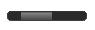

`HScrollBar` is a `Valueable` Widget derived from `HScale`. It displays a value
as a horizontal scrollbar and supports user interaction via `Draggable`, and 
`Scrollable`. Its appearance is defined by the BgColors parameter.

The value can be point value (vsize = 0) or a range value (start value
= widget value; end value = start value + vsize).


### HSlider

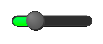

`HSlider` is a `HScale` Widget. It displays a value as a horizontal
slider and supports user interaction via `Clickable`, `Draggable`, and
`Scrollable`. Its appearance is defined by the BgColors parameter (static
elements, knob) and by the FgColors parameter (value).


### ValueHSlider


`ValueHSlider` is a `HSlider` Widget with an additional editable label for
displaying its value.


### HRangeScrollBar

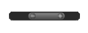

`HRangeScrollBar` is a `Valueable` widget similiar to `HScrollbar`. It displays
a value constisting of a `std::pair` with its min and its max value as a 
horizontal scrollbar and supports user interaction via `Scrollable` to resize
the value range. In addition, it supports dragging to move the value range
or to move the ends (min, max). Its appearance is defined by the BgColors 
parameter.


### VMeter

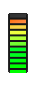

`VMeter` is a `Valueable` Widget and displays a value as a vertical
meter without user interaction. The value is kept within a defined range
and displayed in blocks defined by the parameter *step*. Its appearance
is defined by the parameters BgColors (static elements), FgColors (value,
low range), and HiColors (value, high range).

Advanced settings allow a `VMeter` to display a value in a non-linear
manner (e.g. for levels and frequencies) using transfer functions and / or
to use non-line color gradients for display using gradient functions.


### ValueVMeter

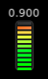

`ValueVMeter` is a `VMeter` Widget with an additional label for
displaying its value.


### VScale

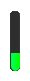

`VScale` is a `Valueable` Widget derived from `VMeter`. It displays a value as a
vertical scale and supports user interaction via `Clickable`, `Draggable`, and 
`Scrollable`. Its appearance is defined by the BgColors parameter (static 
elements) and by the FgColors parameter (value).


### VScrollBar

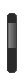

`VScrollBar` is a `Valueable` Widget derived from `VScale`. It displays a value
as a vertical scrollbar and supports user interaction via `Draggable`, and 
`Scrollable`. Its appearance is defined by the BgColors parameter.

The value can be point value (vsize = 0) or a range value (start value
= widget value; end value = start value + vsize).


### VSlider

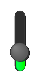

`VSlider` is a `VScale` Widget. It displays a value as a vertical
slider and supports user interaction via `Clickable`, `Draggable`, and
`Scrollable`. Its appearance is defined by the BgColors parameter (static
elements, knob) and by the FgColors parameter (value).


### ValueVSlider

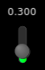

`ValueVSlider` is a `VSlider` Widget with an additional editable label for
displaying its value.


### VRangeScrollBar

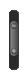

`VRangeScrollBar` is a `Valueable` widget similiar to `VScrollbar`. It displays
a value constisting of a `std::pair` with its min and its max value as a 
vertical scrollbar and supports user interaction via `Scrollable` to resize
the value range. In addition, it supports dragging to move the value range
or to move the ends (min, max). Its appearance is defined by the BgColors 
parameter.


### RadialMeter

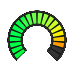

`RadialMeter` is a `Valueable` Widget and displays a value as a radial
meter without user interaction. The value is kept within a defined range
and displayed in blocks defined by the parameter *step*. Its appearance
is defined by the parameters BgColors (static elements), FgColors (value,
low range), and HiColors (value, high range).

Advanced settings allow a `RadialMeter` to display a value in a non-linear
manner (e.g. for levels and frequencies) using transfer functions and / or
to use non-line color gradients for display using gradient functions.


### ValueRadialMeter

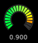

`ValueRadialMeter` is a `RadialMeter` Widget with an additional label for
displaying its value.


### Dial

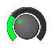

`Dial` is a `Valueable` Widget derived from `RadialMeter`. It displays a pseudo 
3D dial consisting of a knob and an arc scale. It supports user interaction 
via `Clickable`, `Draggable`, and `Scrollable`. Its appearance is defined by 
the BgColors parameter (static elements) and by the FgColors parameter (value).


### ValueDial

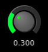

`ValueDial` is a `Dial` Widget with an additional editable label for
displaying its value.


### ConditionalImage

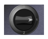

`ConditionalImage` is a `Valueable` widget which may take up multiple images
each linked to a specific value. The widget shows the image(s) depending
on its value. By default, the widget shows the image whos value is the
closest to the widget value.

ConditionalImage supports user interaction via `Clickable`, `Draggable`, and 
`Scrollable`.


### ImageHMeter

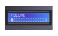

`ImageHMeter` is a `Valueable` widget and displays a value as a horizontal
meter based on images. The visual output is constructed using three
freely selectable images along the provided anchor points:
* static: All static elements in a passive state (background, labels, 
  scales, ...).
* active: All static elements in an active state (LEDs, ...).
* dynamic: The dymacic element (sliding contoller, ...).

ImageHMeter itself doesn't possess any user interaction. The value is 
kept within a defined range and is displayed by the value-dependently
cropped active image and by the position of the dynamic image.


### ImageHSlider

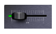

`ImageHSlider` is a `Valueable` widget derived from `ImageHMeter`. It displays 
a value as a horizontal scale in the same way as ImageHMeter and 
additionally supports user interaction via `Clickable`, `Draggable`, and 
`Scrollable`.


### ImageVMeter

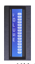

`ImageVMeter` is a `Valueable` widget and displays a value as a vertical
meter based on images. The visual output is constructed using three
freely selectable images along the provided anchor points:
* static: All static elements in a passive state (background, labels, 
  scales, ...).
* active: All static elements in an active state (LEDs, ...).
* dynamic: The dymacic element (sliding contoller, ...).

ImageVMeter itself doesn't possess any user interaction. The value is 
kept within a defined range and is displayed by the value-dependently
cropped active image and by the position of the dynamic image.


### ImageVSlider

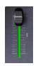

`ImageVSlider` is a `Valueable` widget derived from `ImageVMeter`. It displays 
a value as a vertical scale in the same way as ImageVMeter and 
additionally supports user interaction via `Clickable`, `Draggable`, and 
`Scrollable`.


### ImageRadialMeter

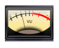

`ImageRadialMeter` is a `Valueable` widget and displays a value as a radial
meter based on images. The visual output is constructed using three
freely selectable images by slicing or rotation around the provided anchor 
points:
 * static: All static elements in a passive state (background, labels, 
   scales, ...).
 * active: All static elements in an active state (LEDs, ...).
 * dynamic: The dymacic element (sliding contoller, ...).
 
ImageRadialMeter itself doesn't possess any user interaction. The value is 
kept within a defined range and is displayed by the value-dependently
cropped active image (pie sliced) and by the position of the dynamic image
(rotated around the anchor).


### ImageDial

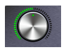

`ImageDial` is a `Valueable` widget derived from `ImageRadialMeter`. It displays 
a value in a radial representation in the same way as ImageRadialMeter and 
additionally supports user interaction via `Clickable`, `Draggable`, and 
`Scrollable`.


### Box

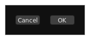

`Box` is a composite Widget based on `Frame` and contains `TextButton`s. It 
also supports `Valueable` and Closeable. The default value of the Box is 0
and changes upon pressing one of the containing text buttons. On pressing
one of the buttons, the widget value is set to the button index (starting)
with 1 and a `CloseRequestEvent` is emitted.


### TextBox

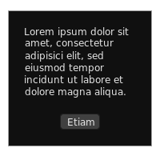

`TextBox` is a composite Widget based on `Box` and additionally contains a
`Text`.


### MessageBox

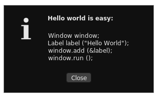

`MessageBox` is a composite Widget based on `TextBox` and additionally 
contains a symbol and a headline.


### SpinBox

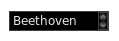

`SpinBox` is a `Valueable` composite widget. It is a container widget. It has
got a list of content widgets representing the items. And it has got a
`SpinButton` to move between the items.

The value of the `SpinBox` is the index of the active item starting with 1. A
value of 0 is used if no item is selected (default empty item).

The visualble content of the `SpinBox` is represented by its background and
its border and by styles of the embedded widgets.


### ListBox


`ListBox` is `Valueable` widget derived from `SpinBox`. This widget shows a 
scrollable list content and allows to select an item. In contrast to `SpinBox`:
* it shows its content in multiple lines and allow selection by clicking on
  an item by the support of Clickable. The selected item is turned in its
  active state.
* it supports navigation via a scroll bar instead of `SpinButton`s.


### ComboBox

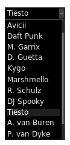

`ComboBox` is `Valueable` widget derived from SpinBox. It shows a `SpinBox`
with a single button. It opens a `ListBox` with the same content upon
clicking on the button.


### FileChooser

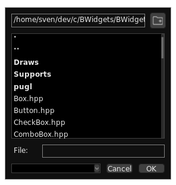

The `FileChooser` is a `Valueable` widget based on `Frame`. It consists of:
* a `Label` to display the current path,
* a "new folder" `SymbolButton`,
* a `ListBox` with the (filtered) content of the current path,
* a `LabelEdit` to display or edit the selected filename,
* a `ComboBox` to select filename filter options,
* a "Cancel" button, and
* an "OK" / "Open" button,

The ListBox fascilitates selection of files and the navigation through
the file system. A selected file is also shown in the LabelEdit.

Clicking on the new folder SymbolButton opens a dialog and the user is
asked to enter a new folder name. The new folder is created within the
current path shown in the Label.

Clicking on "Cancel" will set the widget value to "" and a 
CloseRequestEvent is emitted.

Clicking on "OK" / "Open" will set the widget value to path + filename 
and a CloseRequestEvent is emitted.


### SampleChooser

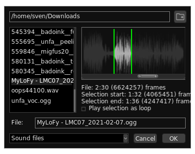

The `SampleChooser` is a widget based on `FileChooser` for the selection of 
audio files and samples. It additionally shows the waveform of the
selected audio file and allows to select a range as a `Sample`.


## Attributes and decorations


### URID

ID number of the widget derived from its URI (see class `BUtilities::Urid`).
The URID is set upon widget construction and can be returned using `getUrid()`.
The widget URID can be used to assign styles and to identify a widget.


### Title

The widget title is shown in the case of a `Window` object in the title bar.
All (other) widgets may show the title on hovering over the widget if the 
title is set (not \"\") and the widget is `Focusable`.

The title can also be used to identify a widget. The widget title is set with 
`setTitle()` and returned by `getTitle()`.


### Visibility

Widgets added directly or indirectly to the main window become visible by 
default. The visibility can be changed using `show()` and `hide()` and is
returned by `isVisible()`. Child widgets become invisible too if their
parent widget is hidden and gain back visibility if their parent widget is
shown again.


### Layer

Widgets can be stored in different layers to be displayed on the screen.
The layer index represents the Z position of the surface. The higher
the index, the more to the background. The default layer has got the
index 0. Negative indexed layers will be displayed in front of the 
default layer, positive indexed layers behind. The widget layer can be
changed using `setLayer()` and is returned by `getLayer()`.


### Level and Stacking

Widgets are displayed in the order they are added to the main window from
back (first added) to front (last added) for the same layer. In the same way, 
child widgets are displayed embedded into the parent widget in order they are 
added to it.

The order (level) within the same layer can be changed using `raise()`, 
`raiseToFront()`, `drop()`, and `dropToBack()`.

By default, child widgets are located within their parents and oversized child 
widgets will be clipped to fit (`STACKING_NORMAL`). `STACKING_ESCAPE` breaks
this limitation. Stacking behaviour can be changed using `setStacking()` and
is returned by `getStacking()`


### Position

A widget can be placed relative to its parent widget using `moveTo()` using
X and Y coordinates and `moveRel()`. Its position relative to its parent widget
is returned by `getPosition()`. The methods `left()`, `center()`, `right()`, 
`top()`, `middle()`, and `bottom()` can be used to get widget X or Y 
coordinates for relative placement of the widget in combination with 
`moveTo()`.

Thus, to center a widget (horizontally and vertically) relative to its parent
widget simply call:

```
widget.moveTo (widget.center(), widget.middle());
```


### Size

Widgets are created either with the size passed in their respective 
constructors or (if not passed) with their default size. The default size of
each is define by `BWIDGETS_DEFAULT_XXX_WIDTH` and 
`BWIDGETS_DEFAULT_XXX_HEIGHT` (with XXX = capitalized widget class name). You 
can define your own default extends of a widget class *prior* the include, 
e. g.:
```
#define BWIDGETS_DEFAULT_BUTTON_WIDTH 40
#define BWIDGETS_DEFAULT_BUTTON_HEIGHT 40
```

The size of a created widget can be changed using `resize()` and is returned by
`getExtends()`, `getWidth()`, or `getHeight()`. The parameter-free `resize()`
methods tries to optimize (or minimalize, depending on the widget type) the 
widget size and to fit the widget size to its content. The parameter-free 
`resize()` may resize the widget to (0, 0) if it has got no children and no 
visualizable content.


### Style

Widgets can be decorates with styles using `setStyle()`. The setter methods
`setBackground()`, `setBorder()`, `setFont()`, `setFgColors()`, 
`setBgColors()`, and `setTxColors()` and their respective getter methods 
`getBackground()`, `getBorder()`, `getFont()`, `getFgColors()`, 
`getBgColors()`, and `getTxColors()` allow a shortcut access to the default
widget StyleProperties:
* *Background*, a `BStyles::Fill`, which can take up an image or a color.
* *Border*, a `BStyles::Border`, defined by its parameters margin, line (width, 
  color), padding, and corner radius.
* *Font*, a `BStyles::Font`.
* *FgColors*, a `BStyles::ColorMap` (a `std::map` consisting of a 
  `BStyles::Color` for each status) for active / foreground widget elements.
* *BgColors*, a `BStyles::ColorMap` for inactive / background widget elements.
* *TxColors*, a `BStyles::ColorMap` for text and labels.

Example: Changing the text colors of a label `l` is simply done by:

```
l.setTxColors (reds);    // Changes text colors for l to reds
```

Styles can also include other styles in a recursive way to describe specific 
widget elements or to forward them to linked child widgets which are idetified
by their URIDs via push notifications (default behaviour). Note: You can 
switch on / off automatic pushing styles to child widgets by 
`enablePushStyle()`.

The following example defines the style with ALL default StyleProperties for 
the widget addressed with `setStyle()` and forwards the "sliders" style to all 
child widgets with the URID for `URI "/sliders"`:
```
Style style =
{
    {Urid::urid (STYLEPROPERTY_BORDER_URI), makeAny<Border>(noBorder)},
    {Urid::urid (STYLEPROPERTY_BACKGROUND_URI), makeAny<Fill>(noFill)},
    {Urid::urid (STYLEPROPERTY_FONT_URI), makeAny<Font>(sans12pt)},
    {Urid::urid (STYLEPROPERTY_FGCOLORS_URI), makeAny<ColorMap>(darks)},
    {Urid::urid (STYLEPROPERTY_BGCOLORS_URI), makeAny<ColorMap>(greens)},
    {Urid::urid (STYLEPROPERTY_TXCOLORS_URI), makeAny<ColorMap>(whites)},

    {Urid::urid (URI "/sliders"), makeAny<Style>({
        {Urid::urid (STYLEPROPERTY_BORDER_URI), makeAny<Border>(noBorder)},
        {Urid::urid (STYLEPROPERTY_BACKGROUND_URI), makeAny<Fill>(noFill)},
        {Urid::urid (STYLEPROPERTY_FONT_URI), makeAny<Font>(sans12pt)},
        {Urid::urid (STYLEPROPERTY_FGCOLORS_URI), makeAny<ColorMap>(yellows)},
        {Urid::urid (STYLEPROPERTY_BGCOLORS_URI), makeAny<ColorMap>(blues)},
        {Urid::urid (STYLEPROPERTY_TXCOLORS_URI), makeAny<ColorMap>(whites)},
    })}
};
```

You can find an example for using different Styles in 
[../examples/styles.cpp](../examples/styles.cpp) :


Some widget classes (e. g., switches, sliders, scales, dials, pads) use Draws
functions (locaded in Draws/) to draw widget elements like pseudo 3D bars, 
pads, and arcs. Feel free to create your own drawing functions and implement
them by pre-defining the respective symbol by
```
#define BWIDGETS_DEFAULT_XXX_PATH "path/to/xxx.cpp"
``` 
with XXX being DRAWKNOB,
DRAWARC, DRAWHBAR, ...

And there's an example for using Draws in 
[../examples/draws.cpp](../examples/draws.cpp) :


### Status

A widget can take the states `STATUS_NORMAL`, `STATUS_ACTIVE`, 
`STATUS_INACTIVE`, `STATUS_OFF`, and `STATUS_USER_DEFINED` as defined in
`BStyles::Status`. The widget status is relevant for status-dependent
decorations (like FgColors, BgColors, and TxColors) and widgets (like `Image`). 

The status is set by `setStatus()` and returned by `getStatus()`.


### Zoom

Main Window attribute to scale the main window and all containing widgets.
The zoom factor is set by `setZoom()` and returned by `getZoom()`.


### Widget-specific attributes and decorations

Specifc widgets may have got specific attributes and decorations. Like values,
ranges, labels, ... . They may inherit their attributes and decorations from 
their Supports (see there).


## Events

Also see main Window.


## Supports

Part of the BWidgets namespace. [Supports](Supports/README.md) are fully or
partially defined interface classes to add additional features to objects
(incl. Widgets).


## Pugl

[Pugl](https://github.com/lv2/pugl) (PlUgin Graphics Library) is a minimal
portable API for GUIs which is suitable for use in plugins. It works on X11,
MacOS, and Windows, and optionally supports Vulkan, OpenGL, and Cairo graphics
contexts. Pugl is written by David Robillard *et al.*

BWidgets uses the Cairo graphics context support of Pugl.


## Internationalization

B.Widgets supports the GNU gettext locale / messages translations catalogues
and additionally uses its own dictionary. You can globally change the language 
of your project either by definition of `BUTILITIES_DICTIONARY_LANGUAGE` with 
the POSIX locale (language[_territory][.codeset][@modifier], e. g. 
"en_US.utf8") *prior* including B.Widgets or using `Dictionary::setLanguage()`:
```
BUtilities::Dictionary::setLanguage ("de_DE.utf8");
```