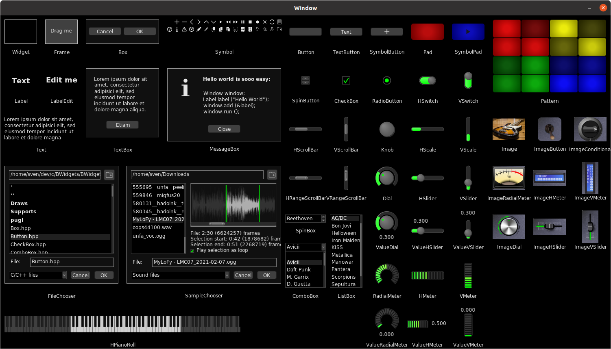

# B.Widgets

Rewrite of the widget toolkit of the B.Music project.

B.Widgets is the Graphical User Interface (GUI) toolkit for the B.Music 
project. This toolkit includes widgets, styles, event handling, device support,
and internationalization. B.Widgets also takes care about the special needs for
user interaction elements in music production. B.Widgets uses the PlUgin Graphics Library ([pugl](https://github.com/lv2/pugl)) portability layer.

**Current version:** 1.5.0




## Dependencies

* C++>=17
* Cairo
* X11 (for Linux systems, for MacOS X and Windows see description)

Install the developers versions of these packages first. BWidgets may also be 
adapted to MacOS X and Windows. For these systems, take hands on and adapt 
the parameter in the makefile.


## Installation
### Get B.Widgets

Clone or copy this repository including its submodules.

```
git clone --recurse-submodules https://github.com/sjaehn/BWidgets
```

will create a folder called `BWidgets` which contains all the files including
the pugl submodule and the examples.


### Build B.Widgets

From the repository you copied or clones you can build three libraries 
(cairoplus, pugl, and bwidgetscore) and optionally the provided examples.

To build all, simply call
```
cd BWidgets
make
```

Optional: All the built binaries (libraries and examples) are now located in 
the just created build subdirectory. You can choose an alternative directory 
by passing the `BUILDDIR` variable to make. Simply call `make` instead:
```
make BUILDDIR=your_build_directory
```

Optional: In addition, an include subdirectory is created where all the library 
header files are stored. Again, you can choose an alternative directory by 
passing the `INCLUDEDIR` variable to make. Simply call `make` instead:
```
make INCLUDEDIR=your_include_directory
```

To execute the respective example, call it form its location, e. g.:
```
build/widgetgallery
```

If you only want to install selected examples, add the name of the example
behind the `make` command separated by a white space, e.g.:
```
make widgetgallery
```

Allowed example names are `widgetgallery`, `helloworld`, `buttontest`, 
`symbols`, `pattern`, `styles`, `themes`, `draws`, `values`, and 
`valuepositions`. Building an example will also build the libraries.

If you only want to install selected libraries, add the name of the library
behind the `make` command separated by a white space, e.g.:
```
make bwidgets
```

Allowed library names are `cairoplus`, `pugl`, and `bwidgets`. Building 
bwidgets will also build the other two libraries.

Note: If you want to use B.Widgets within your project, simply copy or clone 
it as a subdirectory into your project. The header file/directory structure is
the same as in the include subdirectory. 


## Documentation

The toolkit uses tools from six namespaces (further info there):

* [`BDevices`](BDevices/README.md)
* [`BEvents`](BEvents/README.md)
* [`BMusic`](BMusic/README.md)
* [`BStyles`](BStyles/README.md)
* [`BUtilities`](BUtilities/README.md)
* [`BWidgets`](BWidgets/README.md)

For a detailed documentation and examples see [`BWidgets/README.md`](BWidgets/README.md).


## Examples

Software projects using this toolkit:
* [B.Amp](https://github.com/sjaehn/BAmp) - A simple LV2 amplifier example audio plugin
* [B.Angr](https://github.com/sjaehn/BAngr) - A dynamic audio distortion LV2 plugin
* [B.Choppr](https://github.com/sjaehn/BChoppr) - An audio stream chopping LV2 plugin


## Features

- [x] Widgets
  - [x] Basic container widgets (`Widget`, `Window`, `Frame`, ...)
  - [x] Text widgets (`Label`, `Text`, ...)
  - [x] Button and switch widgets
  - [x] Choice box widgets (`SpinBox`, `ListBox`, `ComboBox`, ...)
  - [x] Meter widgets
  - [x] Sliders and dial widgets
  - [x] Pad widgets
  - [x] Pattern widget
  - [x] Piano roll widget
  - [x] Image-based widgets
  - [x] Dialog widgets (`Box`, `TextBox`, `MessageBox`, ...)
  - [x] File selection dialog widgets (`FileChooser`, `SampleChooser`)
- [x] Styles
  - [x] Types (`Color`, `ColorMap`, `Line`, `Border`, ...)
  - [x] Forward and update styles to child widgets with matching URID (see 
        below)
  - [x] Use themes
- [x] Devices
  - [x] Keyboard support
  - [x] Mouse support
  - [x] Take control (grab) or release control (free) over devices
  - [x] Implement to support dragging, clicking, enter text
- [x] Events
  - [x] Base events (expose, close, ...)
  - [x] Mouse / Pointer events (press, release, click, drag, move, scroll, focus)
  - [x] Keyboard events
  - [x] Value change events
  - [x] Custom message events
  - [x] Handle events in main Window
  - [x] Enable events in widgets using interface classes (Supports)
- [x] Widget functionality
  - [x] Container functionality by supporting `Linkable`
  - [x] Visualization by supporting `Visualizable`
  - [x] Event handling in the main Window
  - [x] Control of event handling by supporting `EventMergeable` and 
        `EventPassable`
  - [x] User interaction by supporting `Clickable`, `Draggable`,
        `Toggleable`, `Scrollable` and `KeyPressable`
  - [x] Generic control over widget values using `Valueable`
  - [x] Additional messages by supporting `Messageable` 
  - [x] Navigation between widgets by supporting `Activatable`, `Enterable`,
        and `Navigatable`
  - [x] Support keyboard shortcuts in dialogs/menus
  - [x] Widget visibility control by supporting `Closeable`
  - [x] Display a (functional) hover text by supporting `PointerFocusable`
  - [x] Enable re-definition of widget default sizes at compile time
        (`BWIDGETS_DEFAULT_XXX_WIDTH` and `BWIDGETS_DEFAULT_XXX_HEIGHT`)
  - [x] Drawing sets (draws): Choose between different widget drawing styles 
        at compile time
  - [x] Define default widget display parameters for a drawing set
  - [x] Define your own substitutable widget elemet drawing functions for
        drawing sets
  - [x] Optimize widget size using `resize()`
  - [x] Show default hover text (widget title, if set) by supporting
        `PointerFocusable`
  - [x] Layers visualization and event handling
  - [x] Scale (zoom) main Window and linked child widgets
  - [x] Reversed Valueable widgets by `setStep()` with negative values
  - [x] Transfer functions to transfer values from an external context to an 
        internal context. 
- [x] URID
  - [x] Static URID management: Link URIs to their respective ID
  - [x] Assign URIDs to styles, widgets, ...
- [x] Dictionary
  - [x] Static management of terms and translations
  - [x] Default dictionary for common UI dialogs
  - [x] Dictionary replacable at compile time
  - [x] Add terms and translations at runtime
  - [x] Optional fallback to installed third party dictionaries (e. g., GTK)
- [x] Shortcut macros (`BURID`, `BDICT`, ...)
- [x] Doxygen documentation


## TODO

### Until 1.6

- [ ] Add keyboard modifiers to pointer events
- [ ] Support fine adjustment for dials and sliders
- [ ] Add keyboard control to dials and sliders


### Until 1.8

- [ ] Enable scale (zoom) for all widgets
- [ ] Vector-based zoom


### Until 1.10

- [ ] Range widgets


### Until 1.12

- [ ] Update pugl
- [ ] Time events


### Until 1.14

- [ ] Class Node
- [ ] Class Shape
- [ ] Shape widget


### Until 1.16

- [ ] Layout widgets
- [ ] Conditional widgets


### Until 1.18+

- [ ] Load images from SVG
- [ ] Use NanoVG
- [ ] Simplify mp3 support
- [ ] Link URID to third party
- [ ] Journal
- [ ] Import styles from TTL
- [ ] Import styles from JSON(-LD)
- [ ] Import dictionary from TTL
- [ ] Import dictionary from JSON(-LD)
- [ ] Functional widget drawing option